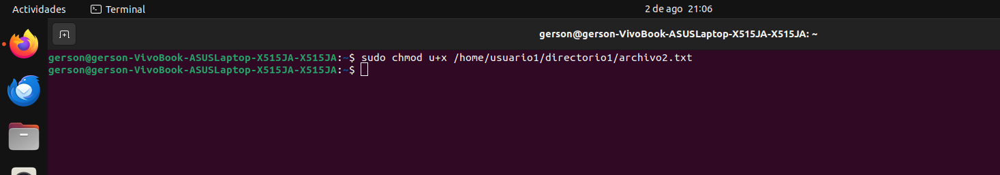

#### Nombre: Gerson Oswaldo Ruiz Ramírez
#### Carné: 202011405

# Parte 1: Gestión de Usuarios

1. **Creación de Usuarios:**
```bash
sudo useradd <nombre usuario>
sudo userdadd usuario1
```


2. **Asignación de Contraseñas:**
```bash
sudo passwd <nombre usuario>
sudo passwd usuario1
```   


3. **Información de Usuarios:**
```bash
id <nombre usuario>
id usuario1
``` 


4. **Eliminación de Usuarios:**
```bash
sudo userdel <nombre usuario>
sudo userdel usuario3
``` 


# Parte 2: Gestión de Grupos
1. **Creación de Grupos:**
```bash
sudo groupadd <nombre del grupo>
sudo groupadd grupo1
``` 


2. **Agregar Usuarios a Grupos:**
```bash
sudo usermod -aG <nombre del grupo> <nombre usuario>
sudo usermod -aG grupo1 usuario1
```    


3. **Verificar Membresía:**
```bash
groups <nombre usuario>
groups usuario1
```  


4. **Eliminar Grupo:**
```bash
sudo groupdel <nombre del grupo>
sudo groupdel grupo2
```   


# Parte 3: Gestión de Permisos
0. **Creación del directorio para el usuario 1 de forma manual y establecer el propietario correcto**
```bash
sudo mkdir -p <path>
sudo mkdir -p /home/usuario1
sudo chown <nombre usuario>:<nombre usuario> <path>
sudo chown usuario1:usuario1 /home/usuario1
```


   
1. **Creación de Archivos y Directorios:**

```bash
sudo -u <nombre usuario> touch <path>
#crear archivo
sudo -u usuario1 touch /home/usuario1/archivo1.txt
#crear directorio
sudo -u usuario1 mkdir /home/usuario1/directorio1
#crear archivo
sudo -u usuario1 touch /home/usuario1/directorio1/archivo2.txt
#escribir dentro del archivo
echo "SISTEMAS OPERATIVOS 1 SEGUNDO SEMESTRE 2024 | sudo -u usuario1 tee /home/usuario1/archivo1.txt"
```   


2. **Verificar Permisos:**
```bash
ls -l  <path>
ls -l /home/usuario1/archivo1.txt
ls -ld <path>
ls -ld /home/usuario1/directorio1
```


3. **Modificar Permisos usando `chmod` con Modo Numérico:**
```bash
sudo chmod 640 <path>
sudo chmod 640 /home/usuario1/archivo1.txt
```


4. **Modificar Permisos usando `chmod` con Modo Simbólico:**
```bash
sudo chmod u+x <path>
sudo chmod u+x /home/usuario1/directorio1/archivo2.txt
```


5. **Cambiar el Grupo Propietario:**
```bash
sudo chgrp <nombre del grupo> <path>
sudo chgrp grupo1 /home/usuario1/directorio1/archivo2.txt
```


6. **Configurar Permisos de Directorio:**
```bash
sudo chmod 740 <path>
sudo chmod 740 /home/usuario1/directorio1
```


7. **Comprobación de Acceso:**
```bash
sudo -u <nombre usuario> cat <path>
#Verificar archivo
sudo -u usuario2 cat /home/usuario1/archivo1.txt
#verificar directorio y archivo
sudo -u usuario2 cat /home/usuario1/directorio1/archivo2.txt
```


8. **Verificación Final:**
```bash
ls -l  <path>
ls -l /home/usuario1/archivo1.txt
ls -ld <path>
ls -ld /home/usuario1/directorio1
```


**¿Por qué es importante gestionar correctamente los usuarios y permisos en un sistema operativo?**


    Es importante gestionar de manera correcta los usuarios y permisos en un sistema para así lograr mantener la integridad, seguridad y privacidad de los datos, también, así como cumplir con las normas, control y organización del sistema.

**¿Qué otros comandos o técnicas conocen para gestionar permisos en Linux?**

 - chmod
 - chown
 - chgrp
 - umask
 - setfacl
 - getfacl
