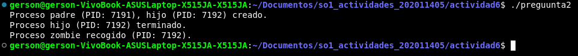
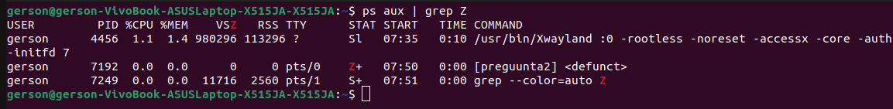
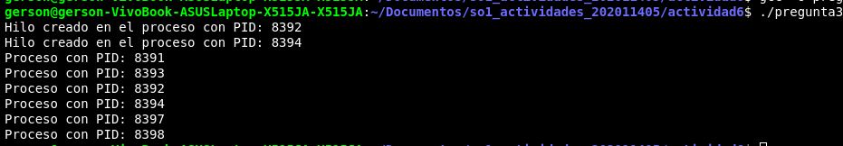

#### Nombre: Gerson Oswaldo Ruiz Ramírez
#### Carné: 202011405
1. En cada una de las llamadas el proceso fork() hace que se dupliquen el numero de procesos que estan en ejecucion en ese momento.

    En cada iteracion de fork() crea un proceso hijo mas el proceso original, por lo tanto en el codigo dado en la primera llamada a fork(), crea dos procesos, padre e hijo, en la segunda llamada genere cuatro procesos ya que lo que hace es que se dupliquen los procesos.

2.
    Procesos Zombie

    

    

3. 
    - ¿Cuántos procesos únicos son creados?
        - Son creado seis procesos unicos.
    
    - ¿Cuántos hilos únicos son creados?
        - Son creados dos hilos unicos.
    

    

    

    

    