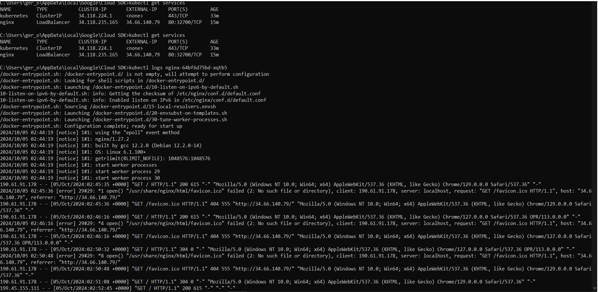
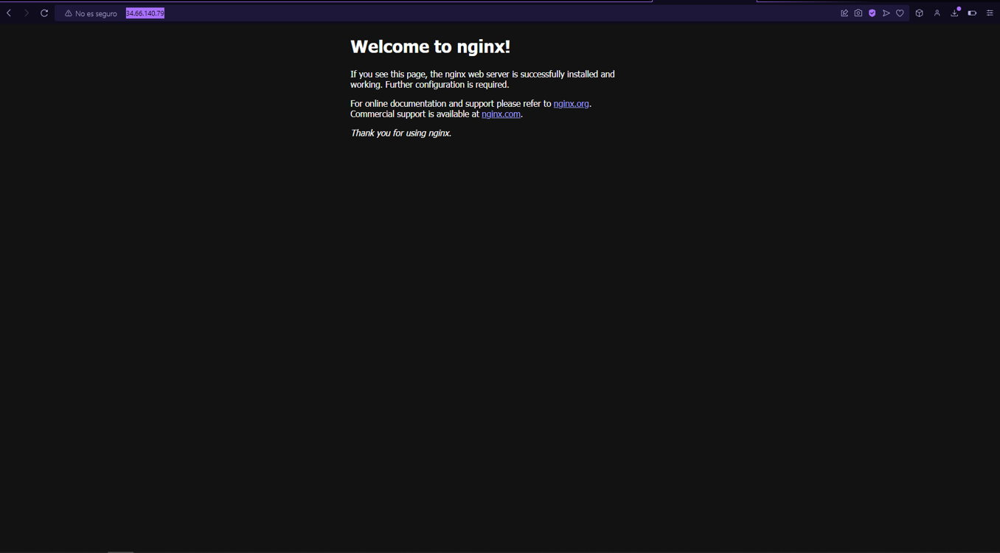

#### Nombre: Gerson Oswaldo Ruíz Ramírez
#### Carné: 202011405

1. 

2. 

3. En un ambiente local de Kubernetes existen los nodos masters y workers, como es que esto funciona?

    En los ambientes locales Kubernetes, ejecuta solo un nodo que se encarga de actuar como nodo master y como nodo workers. Esto significa que todos los componentes que se encuentran en el plano de control que seria la master y los pods que serian los workers se ejecutan en la misma maquina.

    - Nodos Master: estos se encargan de controlar el estado del cluster y son responsables de la programacion de los pods, la gestion de la configuracion y el control de la salud del cluster.
    -  Nodos Workers: estos se encargan de ejecutar las aplicaciones y las cargas de trabajo en el entorno local, el mismo nodo que se encarga de actuar como master tambien ejecuta las cargas de trabajo.

    - Funcionamiento:
      - Cuando se inicia de manera local y se crea un cluster de Kubernetes en una maquina virtual o contenedor, el nodo que contiene el plano de control tambien se encarga de ejecutar los pods.
      - Este tipo de configuracion es ideal para el desarrollo de pruebas, pero en los entornos de produccion, el cluster llegaria a tener multiples nodos master y worker para asi asegurar la alta disponibilidad y escalabilidad.